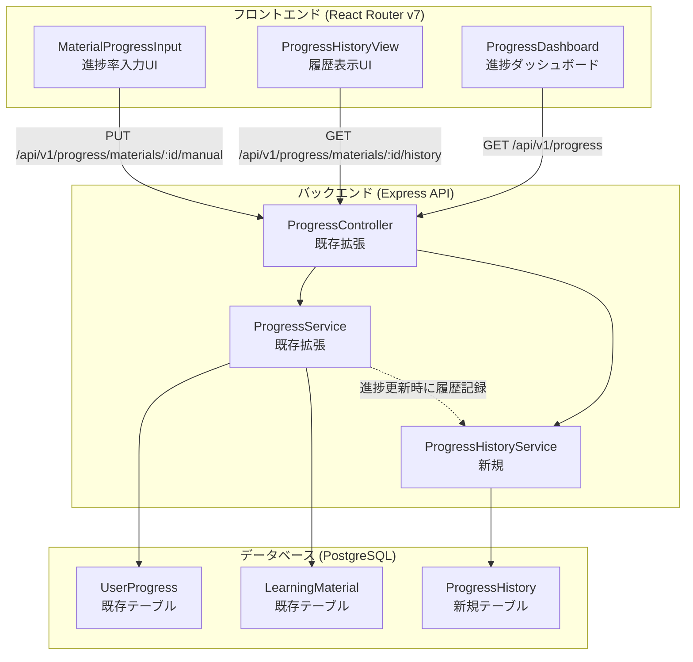
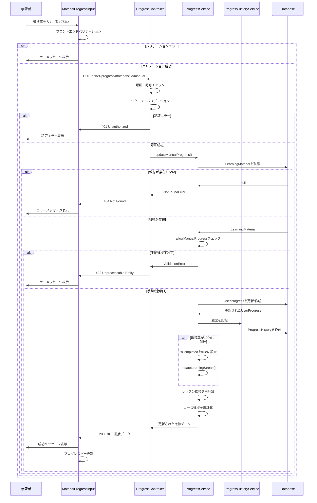
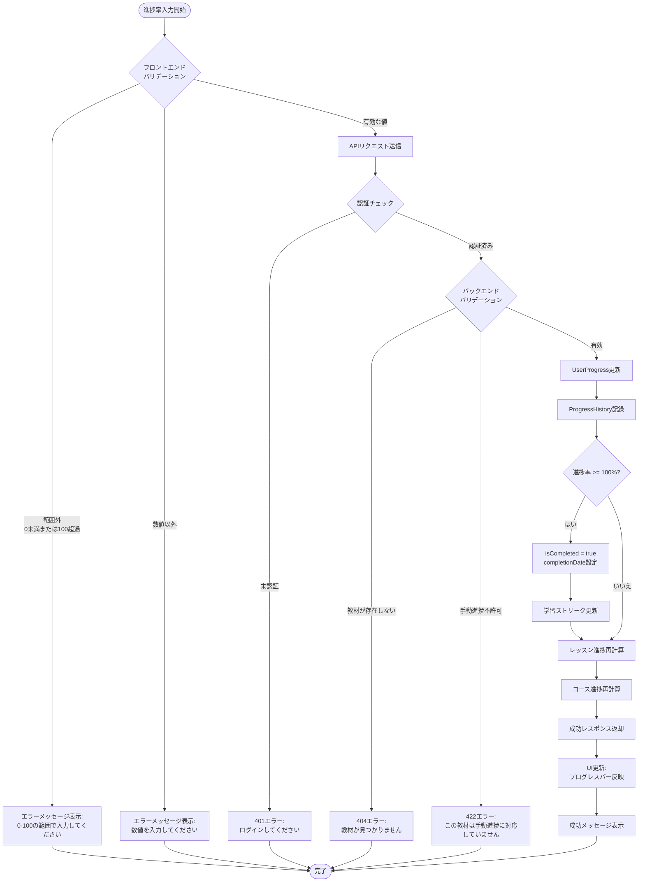
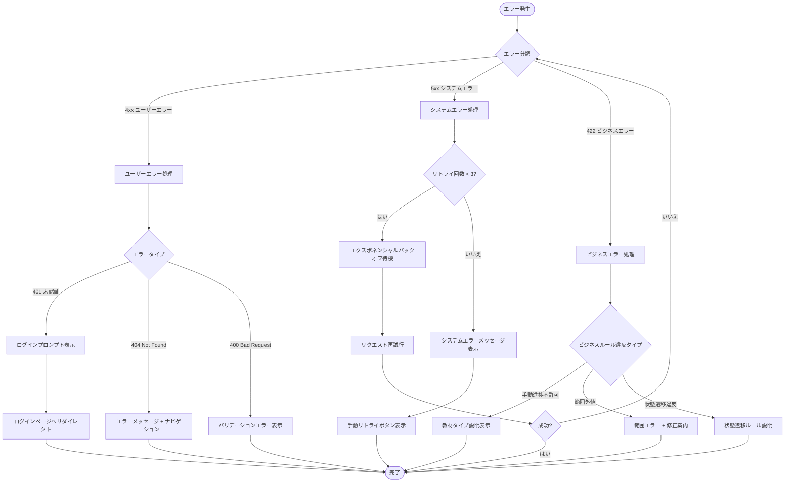

# 技術設計書：メイン教材進捗率記入機能

## 概要

本機能は、学習管理システム（LMS）におけるメイン教材（外部URL教材や手動進捗管理教材）の進捗率を学習者が手動で入力・管理できる機能です。既存の進捗管理システム（`UserProgress`テーブル、`ProgressService`、`ProgressController`）を拡張し、手動進捗率入力のためのフロントエンドUIコンポーネントを新規追加します。

**目的**: 外部サイトやYouTube動画など、システム外で実施した学習活動の進捗を学習者自身が記録し、包括的な学習進捗管理を実現する。

**ユーザー**: 学習者（一般ユーザー）が自身の学習教材進捗を記録するために利用します。

**影響**: 既存の`LearningMaterial.allowManualProgress`フラグと`UserProgress.manualProgressRate`フィールドを活用し、バックエンドの既存実装（`ProgressService.updateManualProgress()`メソッド）を利用します。フロントエンドに新規UIコンポーネントを追加します。

### ゴール
- メイン教材の進捗率を0-100%の範囲で手動入力できる直感的なUIを提供
- 進捗率変更履歴を記録し、学習者が過去の進捗を確認できる
- 進捗率更新時に自動的にレッスン・コース全体の進捗を再計算
- 既存の進捗管理システムとシームレスに統合

### 非ゴール
- 自動進捗追跡機能の変更（既存のファイル型教材の自動進捗計算は変更しない）
- 補足リソース（`LearningResource`）への進捗率入力（メイン教材のみを対象）
- 管理者による他ユーザーの進捗率編集機能
- 進捗率の一括インポート/エクスポート機能

## アーキテクチャ

### 既存アーキテクチャ分析

本機能は既存の進捗管理システムの拡張として実装されます：

**既存のアーキテクチャパターン**:
- 3層アーキテクチャ（Controller → Service → Database）
- Prisma ORMによる型安全なデータベースアクセス
- RESTful APIエンドポイント設計
- React Router v7によるフロントエンドルーティング

**既存のドメイン境界**:
- `LearningMaterial`: 教材マスタデータ（`allowManualProgress`フラグで手動進捗許可を制御）
- `UserProgress`: ユーザーごとの進捗状態（`progressType`で自動/手動を区別）
- `ProgressService`: 進捗計算・更新のビジネスロジック
- `ProgressController`: 進捗APIエンドポイント

**維持すべき統合ポイント**:
- 既存の`PUT /api/v1/progress/materials/:materialId/manual`エンドポイント
- `ProgressService.updateManualProgress()`メソッドのビジネスロジック
- `UserProgress`テーブルのスキーマ構造

**対処する技術的課題**:
- 既存の進捗履歴管理機能が存在しないため、履歴テーブルの新規追加が必要
- フロントエンドに進捗率入力UIが存在しないため、新規コンポーネント作成が必要

### アーキテクチャ概要



**アーキテクチャ統合**:
- **既存パターン保持**: Controller-Service-Repository 3層アーキテクチャを維持
- **新規コンポーネントの根拠**: 
  - `ProgressHistoryService`: 進捗履歴の記録・取得ロジックを分離
  - `MaterialProgressInput`: 進捗率入力専用のReactコンポーネント
  - `ProgressHistory`テーブル: 進捗変更履歴の永続化
- **技術スタック整合性**: 既存のTypeScript、Prisma、Express、React Router v7を使用
- **ステアリング準拠**: プロジェクト構造ガイド（structure.md）、技術スタック（tech.md）に準拠

### 技術整合性

本機能は既存のシステムアーキテクチャと技術スタックに完全に整合します：

**既存技術スタックとの整合**:
- **バックエンド**: TypeScript + Express + Prisma（既存と同じ）
- **フロントエンド**: React Router v7 + TypeScript + Tailwind CSS（既存と同じ）
- **データベース**: PostgreSQL（既存と同じ）

**新規導入される依存関係**:
- なし（既存の技術スタックのみを使用）

**既存パターンからの逸脱**:
- なし（既存のアーキテクチャパターンに完全準拠）

### 主要設計決定

#### 決定1: 進捗履歴を専用テーブルで管理

**決定**: `ProgressHistory`テーブルを新規作成し、進捗率の変更履歴を記録

**コンテキスト**: 
- 要件2「進捗率の履歴管理」を満たすため、過去の進捗率変更履歴を保存する必要がある
- 既存の`UserProgress`テーブルには履歴管理機能が存在しない

**代替案**:
1. `UserProgress`テーブルにJSON配列で履歴を保存
2. イベントソーシングパターンで全変更イベントを記録
3. 専用の`ProgressHistory`テーブルを作成

**選択したアプローチ**: 専用の`ProgressHistory`テーブルを作成

**設計**:
```typescript
model ProgressHistory {
  id            Int       @id @default(autoincrement())
  progressId    Int       @map("progress_id")
  progress      UserProgress @relation(fields: [progressId], references: [id], onDelete: Cascade)
  progressRate  Decimal   @db.Decimal(5, 2)
  spentMinutes  Int
  changedBy     Int       @map("changed_by")
  user          User      @relation(fields: [changedBy], references: [id])
  notes         String?   @db.Text
  createdAt     DateTime  @default(now()) @map("created_at")
  
  @@index([progressId])
  @@index([createdAt])
}
```

**根拠**:
- **クエリパフォーマンス**: 履歴データを独立したテーブルで管理することで、履歴取得クエリが最適化される
- **スケーラビリティ**: 履歴データが増加しても`UserProgress`テーブルのパフォーマンスに影響しない
- **監査証跡**: 誰がいつ変更したかを明確に記録できる
- **既存データ保護**: `UserProgress`テーブルのスキーマ変更を最小限に抑える

**トレードオフ**:
- **利点**: クエリパフォーマンス向上、明確な履歴管理、既存スキーマへの影響最小
- **欠点**: テーブル数の増加、JOIN操作の必要性、トランザクション管理の複雑化

#### 決定2: UIコンポーネントの設計パターン

**決定**: プレゼンテーショナル/コンテナパターンでUIコンポーネントを分離

**コンテキスト**:
- 要件4「UI/UX要件」を満たすため、再利用可能で保守性の高いUIコンポーネントが必要
- 既存のフロントエンドアーキテクチャはコンポーネント駆動設計を採用

**代替案**:
1. 単一の大きなコンポーネントで全機能を実装
2. プレゼンテーショナル/コンテナパターンで責務を分離
3. カスタムフックで状態管理ロジックを分離

**選択したアプローチ**: プレゼンテーショナル/コンテナパターン + カスタムフック

**設計**:
- **コンテナコンポーネント**: `MaterialProgressContainer`（API通信、状態管理）
- **プレゼンテーショナルコンポーネント**: `ProgressInputForm`、`ProgressHistoryList`（UI表示のみ）
- **カスタムフック**: `useProgressUpdate`、`useProgressHistory`（ビジネスロジック）

**根拠**:
- **再利用性**: プレゼンテーショナルコンポーネントは他の画面でも再利用可能
- **テスタビリティ**: ロジックとUIを分離することで単体テストが容易
- **保守性**: 責務が明確に分離され、変更の影響範囲が限定される
- **既存パターン準拠**: プロジェクトの既存コンポーネント設計パターンに一致

**トレードオフ**:
- **利点**: 高い再利用性、テスト容易性、保守性向上
- **欠点**: コンポーネント数の増加、初期実装コストの増加

#### 決定3: 進捗率バリデーションの二重実施

**決定**: フロントエンドとバックエンドの両方でバリデーションを実施

**コンテキスト**:
- 要件6「データ整合性とバリデーション」を満たすため、信頼性の高いデータ検証が必要
- セキュリティベストプラクティスとして、クライアント側の検証のみに依存しない

**代替案**:
1. フロントエンドのみでバリデーション（軽量だが安全性低）
2. バックエンドのみでバリデーション（安全だがUX低下）
3. 両方でバリデーション実施（冗長だが最も安全）

**選択したアプローチ**: フロントエンド・バックエンド両方でバリデーション

**設計**:
- **フロントエンド**: HTML5バリデーション + React状態管理によるリアルタイムフィードバック
- **バックエンド**: express-validatorによるリクエストバリデーション + サービス層での再検証

**根拠**:
- **セキュリティ**: 悪意あるリクエストをバックエンドで防御
- **UX向上**: フロントエンドでのリアルタイムフィードバック
- **データ整合性**: 二重チェックにより不正データの混入を防止
- **ベストプラクティス準拠**: セキュリティファーストの設計原則に一致

**トレードオフ**:
- **利点**: 高セキュリティ、優れたUX、データ整合性保証
- **欠点**: 実装コスト増加、バリデーションロジックの重複

## システムフロー

### シーケンス図：進捗率更新フロー



### プロセスフロー：進捗率バリデーションと更新



## 要件トレーサビリティ

| 要件 | 要件概要 | コンポーネント | インターフェース | フロー |
|------|---------|--------------|---------------|-------|
| 1.1 | 現在の進捗率表示 | MaterialProgressInput | GET /api/v1/progress | シーケンス図 |
| 1.2 | 進捗率入力フォーム提供 | ProgressInputForm | - | - |
| 1.3 | 有効な進捗率の保存 | ProgressService.updateManualProgress() | PUT /api/v1/progress/materials/:id/manual | シーケンス図 |
| 1.4 | 範囲外値のエラー表示 | ProgressInputForm, ProgressController | バリデーションエラーレスポンス | プロセスフロー |
| 1.5 | 数値以外のバリデーションエラー | ProgressInputForm, ProgressController | バリデーションエラーレスポンス | プロセスフロー |
| 1.6 | 100%到達時の完了ステータス更新 | ProgressService.updateManualProgress() | - | シーケンス図、プロセスフロー |
| 1.7 | 100%未満への変更で進行中に戻す | ProgressService.updateManualProgress() | - | プロセスフロー |
| 2.1 | 進捗率履歴の記録 | ProgressHistoryService.recordHistory() | - | シーケンス図 |
| 2.2 | 履歴の新しい順表示 | ProgressHistoryView | GET /api/v1/progress/materials/:id/history | - |
| 2.3 | 履歴エントリの詳細表示 | ProgressHistoryList | - | - |
| 2.4 | 履歴なしメッセージ | ProgressHistoryView | - | - |
| 3.1 | レッスン進捗の自動再計算 | ProgressService.recalculateLessonProgress() | - | シーケンス図、プロセスフロー |
| 3.2 | レッスン総合進捗率の計算 | ProgressService.calculateLessonProgress() | - | プロセスフロー |
| 3.3 | ダッシュボードでの統合表示 | ProgressDashboard | GET /api/v1/progress | - |
| 3.4 | コース全体進捗の自動更新 | ProgressService.recalculateCourseProgress() | - | プロセスフロー |
| 4.1 | プログレスバー表示 | ProgressBar | - | - |
| 4.2 | リアルタイムプレビュー | ProgressInputForm | - | - |
| 4.3 | クイック選択ボタン提供 | ProgressInputForm | - | - |
| 4.4 | クイック選択ボタンクリック処理 | ProgressInputForm | - | - |
| 4.5 | モバイル最適化キーパッド | ProgressInputForm | HTML input type="number" | - |
| 5.1 | 成功通知表示 | MaterialProgressInput | - | シーケンス図 |
| 5.2 | 完了時の祝福メッセージ | MaterialProgressInput | - | シーケンス図、プロセスフロー |
| 5.3 | エラー原因の説明 | MaterialProgressInput | エラーレスポンス | シーケンス図、プロセスフロー |
| 5.4 | ネットワークエラー時の再試行 | MaterialProgressInput | - | - |
| 6.1 | バックエンドバリデーション | ProgressController, ProgressService | - | シーケンス図、プロセスフロー |
| 6.2 | 同時更新の競合制御 | ProgressService | Prismaトランザクション | - |
| 6.3 | 認証セッションチェック | authMiddleware | - | シーケンス図、プロセスフロー |
| 6.4 | 進捗率のデータ型制約 | ProgressHistory Prismaスキーマ | Decimal(5, 2) | - |
| 6.5 | 権限チェック | ProgressController, ProgressService | 401/403エラー | シーケンス図、プロセスフロー |
| 7.1 | 3秒以内のレスポンス | ProgressController, ProgressService | - | - |
| 7.2 | 5秒以内のダッシュボード更新 | ProgressService | - | - |
| 7.3 | 高負荷時の10秒以内処理 | ProgressController, ProgressService | - | - |

## コンポーネントとインターフェース

### バックエンド層

#### ProgressController（既存拡張）

**責務と境界**
- **主な責務**: 進捗管理APIエンドポイントの提供とリクエスト/レスポンス処理
- **ドメイン境界**: プレゼンテーション層（APIエンドポイント）
- **データ所有権**: リクエスト/レスポンスのDTO変換
- **トランザクション境界**: なし（サービス層に委譲）

**依存関係**
- **インバウンド**: フロントエンドReactアプリケーション
- **アウトバウンド**: `ProgressService`、`ProgressHistoryService`
- **外部**: express-validator（リクエストバリデーション）

**契約定義：API契約**

| Method | Endpoint | Request | Response | Errors |
|--------|----------|---------|----------|--------|
| PUT | /api/v1/progress/materials/:materialId/manual | ManualProgressRequest | ProgressResponse | 400, 401, 404, 422, 500 |
| GET | /api/v1/progress/materials/:materialId/history | - | ProgressHistoryResponse | 401, 404, 500 |

**リクエスト/レスポンススキーマ**:

```typescript
// PUT /api/v1/progress/materials/:materialId/manual
interface ManualProgressRequest {
  progressRate: number;      // 0-100の整数
  spentMinutes?: number;     // オプション：学習時間（分）
  notes?: string;            // オプション：メモ
}

interface ProgressResponse {
  success: boolean;
  data: {
    id: number;
    userId: number;
    courseId: number;
    lessonId: number;
    materialId: number;
    progressType: 'MANUAL';
    progressRate: number;
    manualProgressRate: number;
    spentMinutes: number;
    isCompleted: boolean;
    completionDate: string | null;
    notes: string | null;
    lastAccessed: string;
    createdAt: string;
    updatedAt: string;
  };
  message: string;
}

// GET /api/v1/progress/materials/:materialId/history
interface ProgressHistoryResponse {
  success: boolean;
  data: ProgressHistoryEntry[];
  message?: string;
}

interface ProgressHistoryEntry {
  id: number;
  progressRate: number;
  spentMinutes: number;
  changedBy: number;
  notes: string | null;
  createdAt: string;
  previousProgressRate?: number;  // 前回からの差分表示用
  delta?: number;                  // 変更差分
}
```

**エラーレスポンス**:
- `400 Bad Request`: 不正なリクエスト形式
- `401 Unauthorized`: 認証エラー
- `404 Not Found`: 教材が存在しない
- `422 Unprocessable Entity`: 手動進捗が許可されていない教材
- `500 Internal Server Error`: サーバー内部エラー

**事前条件**:
- ユーザーが認証済みである
- 教材IDが有効な整数である
- リクエストボディが正しい形式である

**事後条件**:
- 進捗率が正常に更新される
- 進捗履歴が記録される
- レッスン・コース進捗が再計算される

**不変条件**:
- 認証されたユーザーのみが自身の進捗を更新できる
- 進捗率は常に0-100の範囲である

#### ProgressService（既存拡張）

**責務と境界**
- **主な責務**: 進捗管理のビジネスロジックと進捗計算
- **ドメイン境界**: ビジネスロジック層（進捗管理ドメイン）
- **データ所有権**: `UserProgress`テーブルのCRUD操作
- **トランザクション境界**: 進捗更新と履歴記録のトランザクション境界

**依存関係**
- **インバウンド**: `ProgressController`
- **アウトバウンド**: Prisma Client（`UserProgress`, `LearningMaterial`, `Lesson`, `Course`）、`ProgressHistoryService`
- **外部**: なし

**契約定義：サービスインターフェース**

```typescript
interface ProgressService {
  // 既存メソッド（拡張）
  updateManualProgress(
    userId: number,
    materialId: number,
    progressRate: number,
    spentMinutes?: number,
    notes?: string
  ): Promise<ProgressWithDetails>;
  
  // 新規メソッド
  recalculateLessonProgress(
    userId: number,
    lessonId: number
  ): Promise<void>;
  
  recalculateCourseProgress(
    userId: number,
    courseId: number
  ): Promise<void>;
  
  calculateLessonProgress(
    userId: number,
    lessonId: number
  ): Promise<number>;
}

interface ProgressWithDetails {
  id: number;
  userId: number;
  courseId: number;
  lessonId: number;
  materialId: number;
  progressType: 'AUTO' | 'MANUAL';
  progressRate: Decimal;
  manualProgressRate: Decimal | null;
  spentMinutes: number;
  isCompleted: boolean;
  completionDate: Date | null;
  notes: string | null;
  lastAccessed: Date;
  createdAt: Date;
  updatedAt: Date;
  course: Course;
  lesson: Lesson;
  material: LearningMaterial;
}
```

**事前条件**:
- `userId`と`materialId`が有効である
- 教材が`allowManualProgress = true`である
- `progressRate`が0-100の範囲内である

**事後条件**:
- `UserProgress`が更新または作成される
- 進捗率が100%の場合、`isCompleted = true`、`completionDate`が設定される
- 進捗履歴が`ProgressHistoryService`を通じて記録される
- レッスンおよびコースの進捗率が再計算される

**不変条件**:
- 進捗率は常に0-100の範囲である
- `progressType = 'MANUAL'`の場合、`manualProgressRate`と`progressRate`は同じ値である
- 完了済み教材は`completionDate`を持つ

#### ProgressHistoryService（新規）

**責務と境界**
- **主な責務**: 進捗履歴の記録と取得
- **ドメイン境界**: ビジネスロジック層（履歴管理サブドメイン）
- **データ所有権**: `ProgressHistory`テーブルのCRUD操作
- **トランザクション境界**: 履歴記録は親トランザクションに含まれる

**依存関係**
- **インバウンド**: `ProgressService`、`ProgressController`
- **アウトバウンド**: Prisma Client（`ProgressHistory`）
- **外部**: なし

**契約定義：サービスインターフェース**

```typescript
interface ProgressHistoryService {
  // 履歴記録
  recordHistory(
    progressId: number,
    userId: number,
    progressRate: number,
    spentMinutes: number,
    notes?: string
  ): Promise<ProgressHistory>;
  
  // 履歴取得
  getHistory(
    materialId: number,
    userId: number,
    limit?: number
  ): Promise<ProgressHistoryEntry[]>;
  
  // 履歴削除（オプション機能）
  deleteHistory(
    historyId: number,
    userId: number
  ): Promise<void>;
}

interface ProgressHistory {
  id: number;
  progressId: number;
  progressRate: Decimal;
  spentMinutes: number;
  changedBy: number;
  notes: string | null;
  createdAt: Date;
}
```

**事前条件**:
- `progressId`が有効な`UserProgress`レコードを指す
- `userId`が認証済みユーザーである
- `progressRate`が0-100の範囲内である

**事後条件**:
- 履歴レコードが`ProgressHistory`テーブルに作成される
- 履歴は作成日時の降順で取得される

**不変条件**:
- 履歴レコードは作成後に変更されない（イミュータブル）
- 履歴は常に`UserProgress`に関連付けられる

### フロントエンド層

#### MaterialProgressContainer（新規）

**責務と境界**
- **主な責務**: 進捗率入力機能のコンテナコンポーネント（API通信と状態管理）
- **ドメイン境界**: プレゼンテーション層（コンテナコンポーネント）
- **データ所有権**: コンポーネント内のUI状態
- **トランザクション境界**: なし

**依存関係**
- **インバウンド**: 教材詳細ページ
- **アウトバウンド**: `ProgressInputForm`、`ProgressHistoryView`、`progressService`（APIクライアント）
- **外部**: React Router v7、Axios

**契約定義：Reactコンポーネントインターフェース**

```typescript
interface MaterialProgressContainerProps {
  materialId: number;
  currentProgress?: number;  // 現在の進捗率（0-100）
  onProgressUpdate?: (newProgress: number) => void;
}

export const MaterialProgressContainer: React.FC<MaterialProgressContainerProps> = (props) => {
  // カスタムフック使用
  const { progress, updateProgress, isLoading, error } = useProgressUpdate(props.materialId);
  const { history, fetchHistory } = useProgressHistory(props.materialId);
  
  // UI状態管理とイベントハンドラ
  // ...
};
```

**状態管理**:
- **状態モデル**: ローディング状態、エラー状態、成功状態
- **永続化**: なし（APIから都度取得）
- **並行制御**: 更新中は再送信を防止

#### ProgressInputForm（新規）

**責務と境界**
- **主な責務**: 進捗率入力UIの表示とバリデーション
- **ドメイン境界**: プレゼンテーション層（プレゼンテーショナルコンポーネント）
- **データ所有権**: フォーム入力値
- **トランザクション境界**: なし

**依存関係**
- **インバウンド**: `MaterialProgressContainer`
- **アウトバウンド**: `ProgressBar`（共通コンポーネント）
- **外部**: React、Tailwind CSS

**契約定義：Reactコンポーネントインターフェース**

```typescript
interface ProgressInputFormProps {
  initialProgress: number;  // 初期進捗率
  onSubmit: (progressRate: number, spentMinutes?: number, notes?: string) => Promise<void>;
  isLoading: boolean;
  error?: string;
}

export const ProgressInputForm: React.FC<ProgressInputFormProps> = (props) => {
  // フォーム状態管理
  const [progressRate, setProgressRate] = useState<number>(props.initialProgress);
  const [spentMinutes, setSpentMinutes] = useState<number>(0);
  const [notes, setNotes] = useState<string>('');
  const [validationError, setValidationError] = useState<string>('');
  
  // バリデーション関数
  const validateProgressRate = (value: number): boolean => {
    if (value < 0 || value > 100) {
      setValidationError('0-100の範囲で入力してください');
      return false;
    }
    if (!Number.isInteger(value)) {
      setValidationError('整数を入力してください');
      return false;
    }
    setValidationError('');
    return true;
  };
  
  // クイック選択ハンドラ
  const handleQuickSelect = (value: number) => {
    setProgressRate(value);
  };
  
  // 送信ハンドラ
  const handleSubmit = async (e: React.FormEvent) => {
    e.preventDefault();
    if (!validateProgressRate(progressRate)) return;
    await props.onSubmit(progressRate, spentMinutes, notes);
  };
  
  // JSX
  return (
    <form onSubmit={handleSubmit}>
      {/* プログレスバープレビュー */}
      <ProgressBar value={progressRate} max={100} />
      
      {/* 数値入力フィールド */}
      <input
        type="number"
        min="0"
        max="100"
        step="1"
        value={progressRate}
        onChange={(e) => setProgressRate(Number(e.target.value))}
        inputMode="numeric"  // モバイル最適化
      />
      
      {/* クイック選択ボタン */}
      <div className="quick-select-buttons">
        {[0, 25, 50, 75, 100].map(value => (
          <button type="button" onClick={() => handleQuickSelect(value)}>
            {value}%
          </button>
        ))}
      </div>
      
      {/* オプション入力フィールド */}
      <input
        type="number"
        placeholder="学習時間（分）"
        value={spentMinutes}
        onChange={(e) => setSpentMinutes(Number(e.target.value))}
      />
      
      <textarea
        placeholder="メモ（任意）"
        value={notes}
        onChange={(e) => setNotes(e.target.value)}
      />
      
      {/* バリデーションエラー表示 */}
      {validationError && <p className="error">{validationError}</p>}
      {props.error && <p className="error">{props.error}</p>}
      
      {/* 送信ボタン */}
      <button type="submit" disabled={props.isLoading}>
        {props.isLoading ? '保存中...' : '保存'}
      </button>
    </form>
  );
};
```

**事前条件**:
- `initialProgress`が0-100の範囲内である
- `onSubmit`コールバックが提供される

**事後条件**:
- バリデーション成功時に`onSubmit`が呼び出される
- バリデーションエラーはフォーム内に表示される

#### ProgressHistoryView（新規）

**責務と境界**
- **主な責務**: 進捗履歴の表示
- **ドメイン境界**: プレゼンテーション層（プレゼンテーショナルコンポーネント）
- **データ所有権**: 表示用の履歴データ
- **トランザクション境界**: なし

**依存関係**
- **インバウンド**: `MaterialProgressContainer`
- **アウトバウンド**: `ProgressHistoryList`
- **外部**: React、i18next（国際化）

**契約定義：Reactコンポーネントインターフェース**

```typescript
interface ProgressHistoryViewProps {
  history: ProgressHistoryEntry[];
  isLoading: boolean;
}

export const ProgressHistoryView: React.FC<ProgressHistoryViewProps> = (props) => {
  if (props.isLoading) {
    return <Loading />;
  }
  
  if (props.history.length === 0) {
    return <p>まだ進捗の記録がありません</p>;
  }
  
  return <ProgressHistoryList history={props.history} />;
};

interface ProgressHistoryListProps {
  history: ProgressHistoryEntry[];
}

export const ProgressHistoryList: React.FC<ProgressHistoryListProps> = (props) => {
  return (
    <ul className="progress-history-list">
      {props.history.map((entry) => (
        <li key={entry.id}>
          <div className="history-entry">
            <span className="date">{formatDate(entry.createdAt)}</span>
            <span className="progress-rate">{entry.progressRate}%</span>
            {entry.delta !== undefined && (
              <span className={`delta ${entry.delta >= 0 ? 'positive' : 'negative'}`}>
                {entry.delta >= 0 ? '+' : ''}{entry.delta}%
              </span>
            )}
            {entry.notes && <p className="notes">{entry.notes}</p>}
          </div>
        </li>
      ))}
    </ul>
  );
};
```

#### カスタムフック

```typescript
// useProgressUpdate.ts
export const useProgressUpdate = (materialId: number) => {
  const [progress, setProgress] = useState<number>(0);
  const [isLoading, setIsLoading] = useState<boolean>(false);
  const [error, setError] = useState<string>('');
  
  const updateProgress = async (
    progressRate: number,
    spentMinutes?: number,
    notes?: string
  ) => {
    setIsLoading(true);
    setError('');
    
    try {
      const response = await progressService.updateManualProgress(
        materialId,
        { progressRate, spentMinutes, notes }
      );
      setProgress(response.data.progressRate);
    } catch (err) {
      if (axios.isAxiosError(err)) {
        setError(err.response?.data?.error || 'エラーが発生しました');
      } else {
        setError('予期しないエラーが発生しました');
      }
      throw err;
    } finally {
      setIsLoading(false);
    }
  };
  
  return { progress, updateProgress, isLoading, error };
};

// useProgressHistory.ts
export const useProgressHistory = (materialId: number) => {
  const [history, setHistory] = useState<ProgressHistoryEntry[]>([]);
  const [isLoading, setIsLoading] = useState<boolean>(false);
  
  const fetchHistory = async () => {
    setIsLoading(true);
    try {
      const response = await progressService.getProgressHistory(materialId);
      setHistory(response.data);
    } catch (err) {
      console.error('Failed to fetch progress history:', err);
    } finally {
      setIsLoading(false);
    }
  };
  
  useEffect(() => {
    fetchHistory();
  }, [materialId]);
  
  return { history, fetchHistory, isLoading };
};
```

## データモデル

### 物理データモデル

本機能では、既存の`UserProgress`テーブルを活用し、新規に`ProgressHistory`テーブルを追加します。

#### 既存テーブル：UserProgress

```prisma
model UserProgress {
  id                  Int               @id @default(autoincrement())
  userId              Int               @map("user_id")
  user                User              @relation(fields: [userId], references: [id], onDelete: Cascade)
  courseId            Int               @map("course_id")
  course              Course            @relation(fields: [courseId], references: [id], onDelete: Cascade)
  lessonId            Int?              @map("lesson_id")
  lesson              Lesson?           @relation(fields: [lessonId], references: [id], onDelete: Cascade)
  materialId          Int?              @map("material_id")
  material            LearningMaterial? @relation(fields: [materialId], references: [id], onDelete: Cascade)
  progressType        ProgressType      @default(AUTO) @map("progress_type")
  progressRate        Decimal           @default(0.00) @map("progress_rate") @db.Decimal(5, 2)
  manualProgressRate  Decimal?          @map("manual_progress_rate") @db.Decimal(5, 2)
  spentMinutes        Int               @default(0) @map("spent_minutes")
  isCompleted         Boolean           @default(false) @map("is_completed")
  completionDate      DateTime?         @map("completion_date")
  notes               String?           @db.Text
  lastAccessed        DateTime          @default(now()) @map("last_accessed")
  createdAt           DateTime          @default(now()) @map("created_at")
  updatedAt           DateTime          @updatedAt @map("updated_at")
  
  // 新規リレーション
  progressHistory     ProgressHistory[]

  @@unique([userId, courseId, lessonId, materialId], name: "unique_user_progress")
  @@index([userId])
  @@index([courseId])
  @@index([lessonId])
  @@index([isCompleted])
  @@index([lastAccessed])
  @@map("user_progress")
}

enum ProgressType {
  AUTO   @map("auto")
  MANUAL @map("manual")
}
```

**既存フィールドの活用**:
- `progressType`: 'MANUAL'を設定して手動進捗であることを識別
- `manualProgressRate`: 手動入力された進捗率を保存
- `progressRate`: 実際の進捗率（手動入力の場合は`manualProgressRate`と同じ値）
- `isCompleted`: 進捗率が100%に達したかどうか
- `completionDate`: 100%達成日時

**インデックス**:
- `userId`: ユーザー別の進捗取得を高速化
- `courseId`, `lessonId`: コース・レッスン別の進捗集計を高速化
- `isCompleted`: 完了済み教材のフィルタリングを高速化

#### 新規テーブル：ProgressHistory

```prisma
model ProgressHistory {
  id            Int          @id @default(autoincrement())
  progressId    Int          @map("progress_id")
  progress      UserProgress @relation(fields: [progressId], references: [id], onDelete: Cascade)
  progressRate  Decimal      @map("progress_rate") @db.Decimal(5, 2)
  spentMinutes  Int          @map("spent_minutes")
  changedBy     Int          @map("changed_by")
  user          User         @relation(fields: [changedBy], references: [id])
  notes         String?      @db.Text
  createdAt     DateTime     @default(now()) @map("created_at")

  @@index([progressId])
  @@index([createdAt])
  @@map("progress_history")
}
```

**フィールド説明**:
- `id`: プライマリキー（自動インクリメント）
- `progressId`: `UserProgress`への外部キー
- `progressRate`: この時点での進捗率（0.00-100.00）
- `spentMinutes`: この変更時点での累積学習時間
- `changedBy`: 変更を行ったユーザーID（将来的な管理者編集機能に対応）
- `notes`: 変更時のメモ（オプション）
- `createdAt`: 履歴レコード作成日時

**インデックス**:
- `progressId`: 特定の進捗レコードの履歴取得を高速化
- `createdAt`: 日時順ソートを高速化

**カスケード削除**:
- `UserProgress`が削除された場合、関連する`ProgressHistory`も自動削除

**データ整合性制約**:
- `progressRate`: DECIMAL(5, 2) 型（0.00-100.00の範囲）
- `progressId`: 外部キー制約により、有効な`UserProgress`レコードのみ参照可能
- `changedBy`: 外部キー制約により、有効な`User`レコードのみ参照可能

### データ契約と統合

#### APIデータ転送

**リクエストスキーマ**:
```typescript
// PUT /api/v1/progress/materials/:materialId/manual
{
  "progressRate": 75,           // 必須：0-100の整数
  "spentMinutes": 30,           // オプション：学習時間（分）
  "notes": "Chapter 3まで完了"  // オプション：メモ
}
```

**レスポンススキーマ**:
```typescript
// 成功レスポンス（200 OK）
{
  "success": true,
  "data": {
    "id": 123,
    "userId": 45,
    "courseId": 10,
    "lessonId": 25,
    "materialId": 67,
    "progressType": "MANUAL",
    "progressRate": 75.00,
    "manualProgressRate": 75.00,
    "spentMinutes": 30,
    "isCompleted": false,
    "completionDate": null,
    "notes": "Chapter 3まで完了",
    "lastAccessed": "2025-10-07T00:14:02Z",
    "createdAt": "2025-10-05T12:00:00Z",
    "updatedAt": "2025-10-07T00:14:02Z"
  },
  "message": "Manual progress updated successfully"
}

// エラーレスポンス（422 Unprocessable Entity）
{
  "success": false,
  "error": "Manual progress is not allowed for this material"
}
```

**バリデーションルール**:
- `progressRate`: 必須、0-100の整数、小数点不可
- `spentMinutes`: オプション、0以上の整数
- `notes`: オプション、最大1000文字

**シリアライゼーション形式**: JSON（UTF-8）

#### イベントスキーマ

本機能では明示的なイベント駆動アーキテクチャは採用しませんが、将来的な拡張のためにイベント設計を定義します。

**公開イベント**（将来的な拡張用）:
```typescript
// ProgressUpdatedEvent
{
  "eventType": "progress.updated",
  "timestamp": "2025-10-07T00:14:02Z",
  "userId": 45,
  "materialId": 67,
  "progressRate": 75,
  "isCompleted": false,
  "progressType": "MANUAL"
}

// ProgressCompletedEvent
{
  "eventType": "progress.completed",
  "timestamp": "2025-10-07T00:15:00Z",
  "userId": 45,
  "materialId": 67,
  "progressRate": 100,
  "completionDate": "2025-10-07T00:15:00Z",
  "progressType": "MANUAL"
}
```

**スキーマバージョニング戦略**: セマンティックバージョニング（v1, v2, ...）

**後方互換性ルール**: 
- フィールド追加は許可（オプション）
- フィールド削除は非推奨化後、メジャーバージョンアップで実施
- フィールド型変更は非推奨化が必要

#### サービス間データ管理

**トランザクション境界**:
```typescript
// 進捗更新トランザクション
await prisma.$transaction(async (tx) => {
  // 1. UserProgressを更新
  const progress = await tx.userProgress.update({
    where: { id: progressId },
    data: { progressRate, manualProgressRate, ... }
  });
  
  // 2. ProgressHistoryを記録
  await tx.progressHistory.create({
    data: {
      progressId: progress.id,
      progressRate,
      spentMinutes,
      changedBy: userId,
      notes
    }
  });
  
  // 3. 完了時はLearningStreakを更新
  if (isCompleted) {
    await updateLearningStreak(tx, userId);
  }
});
```

**データ同期戦略**: 
- 進捗更新と履歴記録は同一トランザクション内で実行（強い整合性）
- レッスン・コース進捗の再計算は同期的に実施（リアルタイム反映）

**結果整合性の取り扱い**:
- 基本的に強い整合性を維持
- 将来的にパフォーマンスが問題になった場合、進捗集計のみ結果整合性に移行を検討

## エラーハンドリング

### エラー戦略

本機能では、ユーザーエラー、システムエラー、ビジネスロジックエラーの3つのカテゴリに分けて、それぞれ適切なハンドリングと回復メカニズムを提供します。

### エラーカテゴリと対応

#### ユーザーエラー（4xx）

**不正な入力（400 Bad Request）**:
- **発生条件**: リクエストボディの形式が不正、必須フィールド欠落
- **対応**: フィールドレベルのバリデーションエラーメッセージを表示
- **回復**: ユーザーに正しい入力形式を案内

**未認証（401 Unauthorized）**:
- **発生条件**: JWTトークンが無効、期限切れ、未提供
- **対応**: ログインページへのリダイレクト、セッション期限切れメッセージ表示
- **回復**: 再ログインを促すモーダル表示

**教材が見つからない（404 Not Found）**:
- **発生条件**: 指定された`materialId`のLearningMaterialが存在しない
- **対応**: 「教材が見つかりません」エラーメッセージ表示
- **回復**: 教材一覧ページへのナビゲーションリンク提供

#### システムエラー（5xx）

**インフラストラクチャ障害（500 Internal Server Error）**:
- **発生条件**: データベース接続エラー、Prismaクエリエラー
- **対応**: グレースフルデグラデーション（既存のキャッシュデータを表示）
- **回復**: 自動リトライ（3回まで、エクスポネンシャルバックオフ）

**タイムアウト（504 Gateway Timeout）**:
- **発生条件**: データベースクエリが規定時間（3秒）を超過
- **対応**: サーキットブレーカーパターンで連鎖障害を防止
- **回復**: リトライボタンの表示、キャッシュからのフォールバック

**リソース枯渇（503 Service Unavailable）**:
- **発生条件**: 同時接続数の上限到達、メモリ不足
- **対応**: レート制限メッセージ表示
- **回復**: 待機時間の表示、リトライスケジュール提案

#### ビジネスロジックエラー（422 Unprocessable Entity）

**手動進捗が許可されていない教材（422）**:
- **発生条件**: `LearningMaterial.allowManualProgress = false`の教材に対する手動進捗更新
- **対応**: 「この教材は手動進捗に対応していません」メッセージ表示
- **回復**: 教材タイプの説明と自動進捗の仕組みを案内

**進捗率の範囲外（422）**:
- **発生条件**: `progressRate`が0未満または100超過
- **対応**: 「0-100の範囲で入力してください」バリデーションエラー表示
- **回復**: 入力フィールドのハイライトと正しい範囲の表示

**状態遷移違反（422）**:
- **発生条件**: 完了済み教材の進捗率を変更しようとする（将来的な制約）
- **対応**: 状態遷移のルール説明
- **回復**: 現在の状態と可能な操作を案内

### プロセスフロー：エラーハンドリングとリトライ



### モニタリング

**エラートラッキング**:
- Winston Loggerによる構造化ログ出力
- エラーレベル別のログ記録（ERROR、WARN、INFO）
- ログフォーマット: JSON形式（タイムスタンプ、エラーコード、ユーザーID、リクエストID）

**ロギング戦略**:
```typescript
// エラーログの例
logger.error('Failed to update manual progress', {
  userId: 45,
  materialId: 67,
  errorCode: 'MANUAL_PROGRESS_NOT_ALLOWED',
  errorMessage: 'Manual progress is not allowed for this material',
  requestId: 'req-123456',
  timestamp: '2025-10-07T00:14:02Z',
  stackTrace: error.stack
});
```

**ヘルスモニタリング**:
- `/api/v1/health`エンドポイントでデータベース接続状態を監視
- 進捗更新APIのレスポンスタイム計測（目標: 3秒以内）
- エラー率のメトリクス収集（目標: 99.5%の成功率）

## テスト戦略

### ユニットテスト

**バックエンド - ProgressService**:
1. `updateManualProgress()` - 有効な進捗率で正常に更新できる
2. `updateManualProgress()` - `allowManualProgress = false`の教材でValidationErrorをスロー
3. `updateManualProgress()` - 進捗率100%で`isCompleted`がtrueになる
4. `recalculateLessonProgress()` - レッスン内の全教材進捗から正しく集計できる
5. `calculateLessonProgress()` - 手動進捗と自動進捗を統合して計算できる

**バックエンド - ProgressHistoryService**:
1. `recordHistory()` - 進捗履歴を正常に記録できる
2. `getHistory()` - 日時の新しい順で履歴を取得できる
3. `getHistory()` - 履歴が存在しない場合は空配列を返す

**フロントエンド - ProgressInputForm**:
1. バリデーション - 0未満の値でエラーメッセージを表示
2. バリデーション - 100超過の値でエラーメッセージを表示
3. クイック選択 - ボタンクリックで進捗率が設定される
4. リアルタイムプレビュー - 入力値変更でプログレスバーが更新される
5. フォーム送信 - バリデーション成功時に`onSubmit`が呼ばれる

### 統合テスト

**API統合テスト**:
1. PUT /api/v1/progress/materials/:id/manual - 正常系（進捗率更新成功）
2. PUT /api/v1/progress/materials/:id/manual - 異常系（未認証ユーザー）
3. PUT /api/v1/progress/materials/:id/manual - 異常系（手動進捗不許可教材）
4. GET /api/v1/progress/materials/:id/history - 履歴取得成功
5. 進捗更新時のトランザクション整合性確認（UserProgress + ProgressHistory同時作成）

**コンポーネント統合テスト**:
1. MaterialProgressContainer - API通信とUI更新の統合動作
2. ProgressInputForm + ProgressHistoryView - 進捗更新後の履歴表示更新
3. エラーハンドリング - ネットワークエラー時のリトライ機能

### E2Eテスト（Playwright）

**クリティカルユーザーパス**:
1. ログイン → 教材詳細ページ → 進捗率入力 → 保存 → 成功メッセージ確認
2. 進捗率100%入力 → 完了メッセージ表示 → ダッシュボードで完了ステータス確認
3. 進捗履歴タブ → 履歴一覧表示 → 日時・進捗率・差分の表示確認
4. クイック選択ボタン → プログレスバープレビュー → 保存 → 反映確認
5. 範囲外値入力 → バリデーションエラー表示 → 修正 → 保存成功

### パフォーマンステスト

**負荷テスト**:
1. 同時100ユーザーでの進捗更新APIのレスポンスタイム（目標: 3秒以内）
2. 同時500ユーザーでの進捗更新API（目標: 10秒以内）
3. 大量の履歴データ（1000件）取得時のレスポンスタイム（目標: 2秒以内）
4. データベースクエリの実行計画最適化確認（EXPLAIN ANALYZE）

## セキュリティ考察

**認証と認可**:
- JWT認証ミドルウェア（`authMiddleware`）による認証チェック
- ユーザーは自身の進捗のみ更新可能（`userId`の検証）
- 他ユーザーの進捗更新試行は401/403エラーを返す

**データ保護**:
- 進捗率はDecimal型で厳密に範囲制限（0.00-100.00）
- SQL インジェクション対策: Prismaのパラメータ化クエリ
- XSS対策: フロントエンドでのサニタイゼーション（`notes`フィールド）

**コンプライアンス**:
- 進捗データは個人情報として扱い、GDPR/個人情報保護法に準拠
- 履歴データの保持期間: 最大3年間（設定可能）

## パフォーマンスとスケーラビリティ

**ターゲットメトリクス**:
- 進捗更新APIレスポンス: 3秒以内（通常負荷）
- 進捗更新APIレスポンス: 10秒以内（高負荷時・500名同時）
- 履歴取得APIレスポンス: 2秒以内
- ダッシュボード集計更新: 5秒以内

**スケーリングアプローチ**:
- **水平スケーリング**: Expressアプリケーションのコンテナ複製（ステートレス設計）
- **データベース最適化**: `ProgressHistory`テーブルへのインデックス追加（`progressId`, `createdAt`）
- **クエリ最適化**: N+1問題の回避（Prisma includeによる効率的なJOIN）

**キャッシング戦略**:
- 現時点では実装しない（リアルタイム性を優先）
- 将来的にRedisによる進捗集計データのキャッシング検討

**最適化技術**:
- データベースコネクションプーリング（Prisma設定）
- 進捗再計算の最適化（レッスン単位でバッチ処理）
- フロントエンドでの楽観的UI更新（即座に反映、バックグラウンドで同期）

---

## 次のステップ

設計書をレビューし、以下のいずれかを選択してください：

### ✅ 設計が適切な場合
```bash
/kiro:spec-tasks main-material-progress -y
```
`-y`フラグで設計を自動承認し、実装タスクフェーズに進みます。

### ✏️ 修正が必要な場合
修正内容をお知らせください。設計書を更新後、再度このコマンドを実行します。

### 🔍 追加の図やセクションが必要な場合
追加してほしい内容（例：データフロー図、状態遷移図、セキュリティ脅威モデルなど）をお知らせください。
