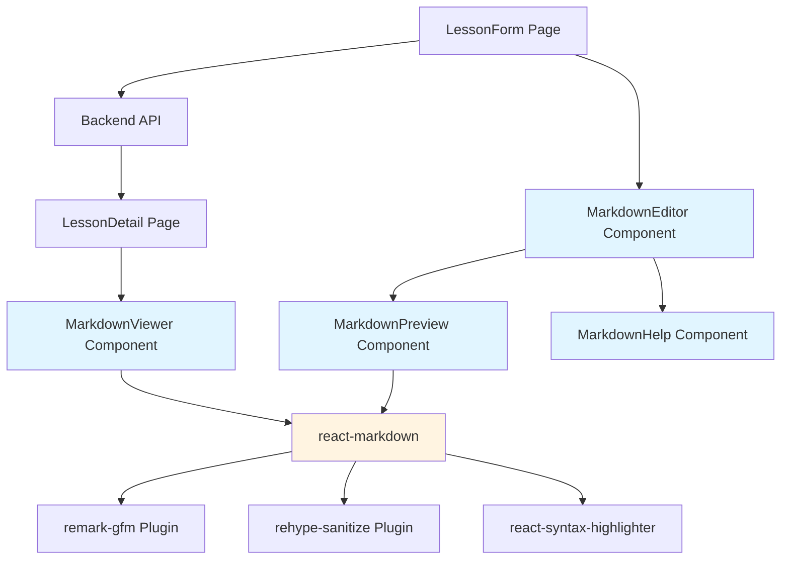
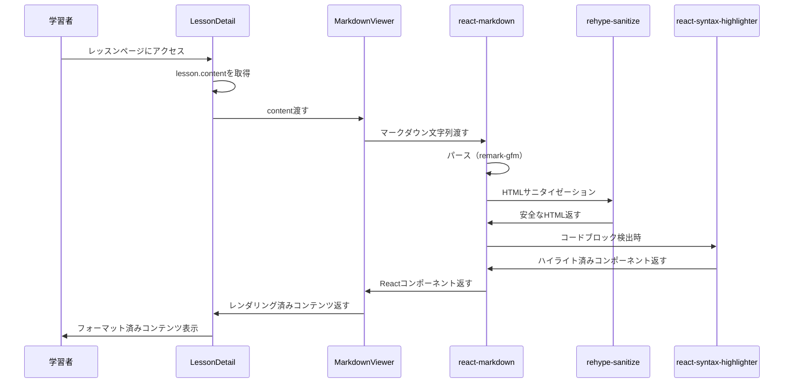
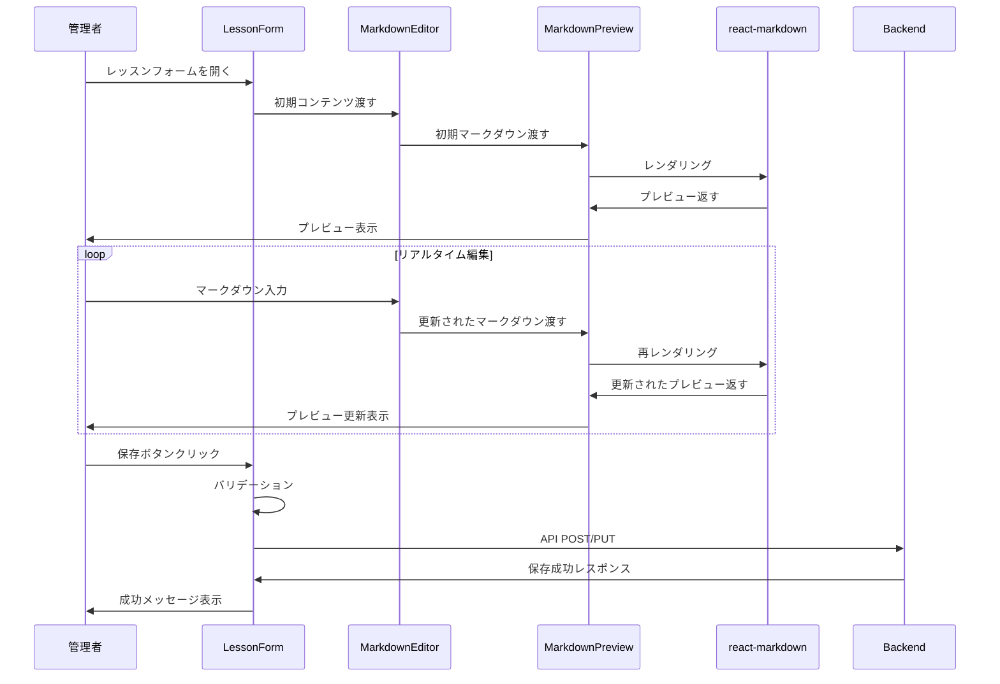
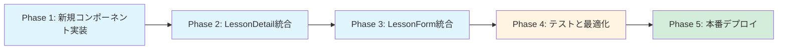

# 技術設計書

## 概要

本機能は、学習管理システム（LMS）にマークダウンレンダリング機能を追加し、レッスンコンテンツをマークダウン形式で作成・表示できるようにします。現在、レッスンの`content`フィールドはHTMLとして`dangerouslySetInnerHTML`で直接レンダリングされていますが、この実装は以下の課題を抱えています：

1. **セキュリティリスク**: XSS攻撃に対する脆弱性
2. **コンテンツ作成の複雑さ**: 教育者がHTMLを直接記述する必要がある
3. **保守性の低さ**: HTMLコンテンツの編集・管理が困難

マークダウンレンダリング機能により、教育者は読みやすいマークダウン形式でコンテンツを作成でき、学習者は安全かつ美しくフォーマットされたコンテンツを閲覧できるようになります。

### ゴール

- 既存のレッスン詳細ページ（LessonDetail.tsx）にマークダウンレンダリング機能を統合
- レッスンフォーム（LessonForm.tsx）にリアルタイムプレビュー機能を追加
- XSS攻撃を防ぐセキュアなマークダウンレンダリングを実現
- シンタックスハイライト付きコードブロック表示
- レスポンシブでアクセシブルなUI/UX

### 非ゴール

- 既存のHTML形式コンテンツの自動マークダウン変換（将来的な拡張として検討）
- マークダウンエディタのWYSIWYG機能（フェーズ1では対象外）
- リアルタイム協調編集機能
- バージョン管理やコンテンツ履歴機能

## アーキテクチャ

### 既存アーキテクチャ分析

現在のレッスンコンテンツレンダリングは以下の実装になっています：

```typescript
// frontend/src/pages/LessonDetail.tsx (239-240行目)
<div className="prose max-w-none">
  {lesson.content ? (
    <div dangerouslySetInnerHTML={{ __html: lesson.content }} />
  ) : (
    // コンテンツなしメッセージ表示
  )}
</div>
```

**課題**:
- `dangerouslySetInnerHTML`によるXSS脆弱性
- サニタイゼーション機構の欠如
- マークダウン形式のサポートなし

### 高レベルアーキテクチャ



### 技術整合性

**既存技術スタックとの整合**:
- React 19.1.0との完全互換性
- TypeScript strict modeでの型安全性
- Tailwind CSSによるスタイリングパターンの継続
- 既存コンポーネント構造（`frontend/src/components/`）との統合

**新規依存関係**:
- `react-markdown`: マークダウンレンダリングコア（推奨バージョン: ^9.0.0）
- `remark-gfm`: GitHub Flavored Markdown対応（^4.0.0）
- `rehype-sanitize`: XSS防止のためのHTMLサニタイゼーション（^6.0.0）
- `react-syntax-highlighter`: コードブロックのシンタックスハイライト（^15.5.0）

### 主要な設計判断

#### 判断1: react-markdownの採用

**コンテキスト**: マークダウンレンダリングライブラリの選定

**検討した代替案**:
1. **marked**: 高速で軽量だがReact統合が弱い、手動でのセキュリティ対策が必要
2. **markdown-it**: 拡張性が高いがプラグインエコシステムが複雑、React向けではない
3. **react-markdown**: Reactネイティブ、デフォルトで安全、豊富なプラグインエコシステム

**選択したアプローチ**: react-markdown + unified/remark/rehypeエコシステム

**理由**:
- **デフォルトでのセキュリティ**: `dangerouslySetInnerHTML`を使用せず、XSS攻撃に対して安全
- **React統合**: コンポーネントベースのカスタマイズが容易
- **豊富なプラグイン**: remark/rehypeエコシステムによる機能拡張
- **TypeScript対応**: 完全な型定義とIDEサポート
- **コミュニティとメンテナンス**: 活発な開発とドキュメント（週間5.7M+ダウンロード）

**トレードオフ**:
- **得られるもの**: セキュリティ、React統合、メンテナンス性、拡張性
- **犠牲にするもの**: 若干のバンドルサイズ増加（tree-shakingで最小化可能）、markedやmarkdown-itと比較してわずかに遅いパース速度（実用上は問題なし）

#### 判断2: rehype-sanitizeによるサニタイゼーション

**コンテキスト**: マークダウン内のHTMLコンテンツのセキュリティ対策

**検討した代替案**:
1. **HTMLを完全に無効化**: 最も安全だが柔軟性に欠ける
2. **DOMPurify**: 強力だがreact-markdownとの統合に追加の実装が必要
3. **rehype-sanitize**: react-markdownのプラグインとして直接統合可能

**選択したアプローチ**: rehype-sanitize + カスタムスキーマ

**理由**:
- **統合性**: react-markdownのrehypeプラグインとしてシームレスに動作
- **GitHub準拠**: デフォルトでGitHubのサニタイゼーションスキーマを使用
- **カスタマイズ性**: 必要に応じてホワイトリストをカスタマイズ可能
- **パフォーマンス**: レンダリングパイプライン内で効率的に処理

**トレードオフ**:
- **得られるもの**: セキュリティ、統合の容易さ、メンテナンス性
- **犠牲にするもの**: 一部のHTML要素・属性が制限される（必要に応じてスキーマで許可可能）

#### 判断3: react-syntax-highlighter（Prism）の採用

**コンテキスト**: コードブロックのシンタックスハイライト実装

**検討した代替案**:
1. **Highlight.js**: 豊富な言語対応だがJSX/TSXサポートなし
2. **Prism.js**: 軽量でJSX/TSX対応、モダンな言語サポート
3. **カスタム実装**: 完全な制御だが開発コストが高い

**選択したアプローチ**: react-syntax-highlighter + Prism（Light Build）

**理由**:
- **JSX/TSX対応**: プログラミング学習で重要なReact/TypeScriptのシンタックスハイライト
- **軽量なLight Build**: 必要な言語のみを個別インポートしてバンドルサイズを最小化
- **React統合**: コンポーネントベースの統合が容易
- **豊富なテーマ**: 既存のPrismテーマを活用可能

**トレードオフ**:
- **得られるもの**: JSX/TSXサポート、軽量性、React統合
- **犠牲にするもの**: 言語ごとの個別インポートが必要（自動検出ではない）

## システムフロー

### シーケンス図: マークダウンレンダリングフロー（学習者視点）



### シーケンス図: マークダウンプレビューフロー（管理者視点）



## 要件トレーサビリティ

| 要件 | 要件概要 | コンポーネント | インターフェース | フロー |
|------|----------|--------------|----------------|--------|
| 1.1 | マークダウン自動レンダリング | MarkdownViewer | MarkdownViewerProps | マークダウンレンダリングフロー |
| 1.2 | 標準マークダウン構文サポート | react-markdown + remark-gfm | remarkPlugins配列 | - |
| 1.3 | シンタックスハイライト | CodeBlock (カスタムコンポーネント) | components.code | - |
| 1.4 | 空コンテンツハンドリング | MarkdownViewer | fallbackContent prop | - |
| 2.1 | XSSサニタイゼーション | rehype-sanitize | rehypePlugins配列 | - |
| 2.2 | 外部リンクセキュリティ | LinkRenderer (カスタムコンポーネント) | components.a | - |
| 2.3 | 画像エラーハンドリング | ImageRenderer (カスタムコンポーネント) | components.img | - |
| 3.1-3.3 | レスポンシブ表示 | Tailwind CSSクラス | className prop | - |
| 4.1-4.3 | マークダウンプレビュー | MarkdownEditor + MarkdownPreview | EditorPreviewLayout | マークダウンプレビューフロー |
| 5.1-5.3 | マークダウンヘルプ | MarkdownHelp | MarkdownHelpProps | - |
| 6.1 | パフォーマンス（3秒以内） | 全コンポーネント | - | - |
| 6.2-6.4 | アクセシビリティ | セマンティックHTML + ARIA属性 | - | - |

## コンポーネントとインターフェース

### 表示層（Lesson Content Display）

#### MarkdownViewer

**責任と境界**
- **主要責任**: マークダウンコンテンツを安全にHTMLにレンダリングして表示
- **ドメイン境界**: UI/表示層 - コンテンツレンダリングのみを担当、データ取得や状態管理は行わない
- **データ所有権**: レンダリング用の一時的なHTML構造のみ（元のマークダウンテキストは親コンポーネントが所有）
- **トランザクション境界**: なし（読み取り専用コンポーネント）

**依存関係**
- **インバウンド**: LessonDetail, MarkdownPreview
- **アウトバウンド**: react-markdown, rehype-sanitize, remark-gfm, CodeBlock, LinkRenderer, ImageRenderer
- **外部**: react-markdown (^9.0.0), remark-gfm (^4.0.0), rehype-sanitize (^6.0.0)

**コントラクト定義**

```typescript
interface MarkdownViewerProps {
  /** レンダリングするマークダウンコンテンツ */
  content: string;
  
  /** 空コンテンツ時のフォールバック表示 */
  fallbackContent?: React.ReactNode;
  
  /** 追加のCSSクラス名 */
  className?: string;
  
  /** アクセシビリティ用のARIAラベル */
  ariaLabel?: string;
}

interface MarkdownViewerComponent {
  (props: MarkdownViewerProps): JSX.Element;
}
```

**事前条件**: 
- `content`は文字列型である（nullやundefinedは親コンポーネントでハンドリング）

**事後条件**:
- サニタイズされた安全なHTMLとしてレンダリングされる
- すべての外部リンクに`rel="noopener noreferrer"`が付与される
- コードブロックにシンタックスハイライトが適用される

**不変条件**:
- XSS攻撃に対して安全であること
- アクセシビリティ標準（WCAG 2.1 AA）を満たすこと

#### CodeBlock

**責任と境界**
- **主要責任**: コードブロックのシンタックスハイライト表示
- **ドメイン境界**: UI/コード表示コンポーネント
- **データ所有権**: 表示用のハイライト済みコード（元のコード文字列は親が所有）

**依存関係**
- **インバウンド**: MarkdownViewer (react-markdownのカスタムコンポーネント)
- **アウトバウンド**: react-syntax-highlighter/light (Prism)
- **外部**: react-syntax-highlighter (^15.5.0), prismjs

**コントラクト定義**

```typescript
interface CodeBlockProps {
  /** コード文字列 */
  children: string | string[];
  
  /** 言語識別子（例: "typescript", "python"） */
  className?: string; // 形式: "language-{lang}"
  
  /** インラインコードかブロックコードか */
  inline?: boolean;
  
  /** react-markdownから渡される追加のプロパティ */
  node?: unknown;
}

interface CodeBlockComponent {
  (props: CodeBlockProps): JSX.Element;
}
```

**実装ノート**:
- `className`から言語を抽出: `/language-(\w+)/`正規表現
- インラインコードの場合は`<code>`タグで表示（ハイライトなし）
- ブロックコードの場合はPrismでハイライト

**外部依存関係の調査**:
- **react-syntax-highlighter**: Light Buildを使用して必要な言語のみインポート
- **対応言語**: JavaScript, TypeScript, JSX, TSX, Python, Java, C, C++, Go, Rust, SQL, HTML, CSS, JSON, YAML
- **テーマ**: Prism標準テーマ（oneDark, oneLight等）を使用
- **バンドルサイズ**: 必要な言語のみの個別インポートで50-100KB程度（全言語インポートは避ける）

#### LinkRenderer

**責任と境界**
- **主要責任**: 外部リンクのセキュアなレンダリング
- **ドメイン境界**: UI/リンク表示コンポーネント
- **データ所有権**: リンク属性の決定（href, rel, target）

**依存関係**
- **インバウンド**: MarkdownViewer (react-markdownのカスタムコンポーネント)
- **アウトバウンド**: なし（ネイティブ`<a>`タグ）

**コントラクト定義**

```typescript
interface LinkRendererProps {
  /** リンクURL */
  href?: string;
  
  /** リンクテキスト */
  children: React.ReactNode;
  
  /** 追加のプロパティ */
  node?: unknown;
}

interface LinkRendererComponent {
  (props: LinkRendererProps): JSX.Element;
}
```

**セキュリティ考慮事項**:
- 外部リンク（`http://`, `https://`で始まる）には`rel="noopener noreferrer"`と`target="_blank"`を自動付与
- 内部リンク（相対パス）はそのまま表示

#### ImageRenderer

**責任と境界**
- **主要責任**: 画像の安全な表示とエラーハンドリング
- **ドメイン境界**: UI/画像表示コンポーネント
- **データ所有権**: 画像表示状態（読み込み中、エラー）

**依存関係**
- **インバウンド**: MarkdownViewer (react-markdownのカスタムコンポーネント)
- **アウトバウンド**: なし（ネイティブ``タグ）

**コントラクト定義**

```typescript
interface ImageRendererProps {
  /** 画像URL */
  src?: string;
  
  /** 代替テキスト */
  alt?: string;
  
  /** 画像タイトル */
  title?: string;
  
  /** 追加のプロパティ */
  node?: unknown;
}

interface ImageRendererComponent {
  (props: ImageRendererProps): JSX.Element;
}
```

**エラーハンドリング**:
- 画像読み込み失敗時は代替テキストとアイコンを表示
- `onError`イベントで状態を管理

### 編集層（Lesson Content Editing）

#### MarkdownEditor

**責任と境界**
- **主要責任**: マークダウンコンテンツの編集とプレビュー表示の統合
- **ドメイン境界**: UI/編集層 - 編集UIとプレビューの統合を担当
- **データ所有権**: 編集中のマークダウンテキスト（親フォームとの双方向バインディング）
- **トランザクション境界**: なし（親フォームが保存処理を担当）

**依存関係**
- **インバウンド**: LessonForm
- **アウトバウンド**: MarkdownPreview, MarkdownHelp
- **外部**: なし（標準のReact Hooks）

**コントラクト定義**

```typescript
interface MarkdownEditorProps {
  /** 編集中のマークダウンコンテンツ */
  value: string;
  
  /** 変更時のコールバック */
  onChange: (value: string) => void;
  
  /** テキストエリアのプレースホルダー */
  placeholder?: string;
  
  /** 編集エリアの高さ（デフォルト: 400px） */
  height?: string;
  
  /** エラーメッセージ */
  error?: string;
  
  /** 無効化フラグ */
  disabled?: boolean;
}

interface MarkdownEditorComponent {
  (props: MarkdownEditorProps): JSX.Element;
}
```

**レイアウト**:
- 2カラムレイアウト（デスクトップ）: 編集エリア（左）| プレビューエリア（右）
- 1カラムレイアウト（モバイル）: タブ切り替え（編集 / プレビュー）

**状態管理**:
- `value`はLessonFormの`formData.content`と同期
- `onChange`で親コンポーネントに変更を伝播

#### MarkdownPreview

**責任と境界**
- **主要責任**: 編集中のマークダウンのリアルタイムプレビュー表示
- **ドメイン境界**: UI/プレビュー層
- **データ所有権**: なし（表示のみ）

**依存関係**
- **インバウンド**: MarkdownEditor
- **アウトバウンド**: MarkdownViewer
- **外部**: なし

**コントラクト定義**

```typescript
interface MarkdownPreviewProps {
  /** プレビューするマークダウンコンテンツ */
  content: string;
  
  /** プレビューエリアの高さ */
  height?: string;
}

interface MarkdownPreviewComponent {
  (props: MarkdownPreviewProps): JSX.Element;
}
```

**実装ノート**:
- 内部的に`MarkdownViewer`を使用して一貫したレンダリング
- スクロール同期は将来の拡張として検討

#### MarkdownHelp

**責任と境界**
- **主要責任**: マークダウン記法のヘルプ表示と構文挿入
- **ドメイン境界**: UI/ヘルプ層
- **データ所有権**: ヘルプコンテンツ（静的）

**依存関係**
- **インバウンド**: MarkdownEditor
- **アウトバウンド**: なし（モーダルまたはポップオーバーとして表示）
- **外部**: lucide-react（アイコン）

**コントラクト定義**

```typescript
interface MarkdownHelpProps {
  /** ヘルプを表示するかどうか */
  isOpen: boolean;
  
  /** 閉じるコールバック */
  onClose: () => void;
  
  /** 構文挿入のコールバック */
  onInsertSyntax?: (syntax: string) => void;
}

interface MarkdownHelpComponent {
  (props: MarkdownHelpProps): JSX.Element;
}

interface MarkdownSyntaxExample {
  /** 構文カテゴリ */
  category: '見出し' | 'リスト' | 'リンク' | 'コード' | '画像' | 'その他';
  
  /** 構文名 */
  name: string;
  
  /** マークダウン構文例 */
  syntax: string;
  
  /** レンダリング結果の説明 */
  description: string;
}
```

**実装ノート**:
- モーダルまたはポップオーバーUIとして実装（既存コンポーネントがないため新規作成）
- 構文カテゴリごとにセクション分け
- 各構文例をクリックで編集エリアに挿入

## データモデル

### 論理データモデル

本機能は既存のデータベーススキーマを変更しません。`Lesson`モデルの既存の`content`フィールド（Text型）をそのまま使用します。

```prisma
model Lesson {
  id               Int      @id @default(autoincrement())
  courseId         Int
  title            String   @db.VarChar(200)
  description      String?  @db.Text
  content          String?  @db.Text  // マークダウンまたはHTMLを格納
  // ... その他のフィールド
}
```

**コンテンツ形式の扱い**:
- `content`フィールドにはマークダウン形式のテキストを格納
- HTMLとの互換性維持のため、既存のHTMLコンテンツも引き続き`content`に格納可能
- フロントエンドで自動的にマークダウンとして解釈・レンダリング

### データコントラクト

#### APIレスポンス

既存のAPIエンドポイントのレスポンス形式を変更しません：

```typescript
interface Lesson {
  id: number;
  courseId: number;
  title: string;
  description: string | null;
  content: string | null;  // マークダウンまたはHTML
  estimatedMinutes: number | null;
  sortOrder: number;
  isPublished: boolean;
  createdAt: string;
  updatedAt: string;
}
```

## エラーハンドリング

### エラー戦略

マークダウンレンダリング機能では、以下のエラーカテゴリに対応します：

1. **レンダリングエラー**: マークダウンパース時のエラー
2. **リソース読み込みエラー**: 画像やリンクの読み込み失敗
3. **パフォーマンスエラー**: 大容量コンテンツによるレンダリング遅延

### エラーカテゴリと対応

#### ユーザーエラー（4xx相当）

該当なし（マークダウンレンダリングは読み取り専用で、ユーザー入力バリデーションは親フォームが担当）

#### リソースエラー

**画像読み込み失敗**:
- **状況**: マークダウン内の画像URLが無効または読み込み不可
- **対応**: `ImageRenderer`コンポーネントで`onError`イベントをキャッチし、代替UI（アイコン + altテキスト）を表示
- **ユーザーへのガイダンス**: "画像を読み込めませんでした"メッセージ

**外部リンク切れ**:
- **状況**: マークダウン内の外部リンクが無効
- **対応**: リンクはそのまま表示（クリック時にブラウザの標準エラー）
- **ユーザーへのガイダンス**: なし（リンク先の責任範囲外）

#### システムエラー（5xx相当）

**マークダウンパースエラー**:
- **状況**: react-markdownがコンテンツをパースできない
- **対応**: Error Boundaryでキャッチし、フォールバックUIを表示
- **リカバリ**: 元のマークダウンテキストをプレーンテキストとして表示
- **ログ**: コンソールにエラーログを出力（開発環境）

**レンダリングタイムアウト**:
- **状況**: 大容量コンテンツで3秒以上かかる
- **対応**: Loading Spinnerを表示し、非同期レンダリング
- **リカバリ**: 必要に応じてコンテンツを分割表示

### エラー監視

**ログ記録**:
- ブラウザコンソールにエラー情報を出力
- 本番環境では外部ログサービス（将来的に検討）への送信

**ヘルスチェック**:
- パフォーマンス監視: React DevToolsのProfilerでレンダリング時間を計測
- エラー率監視: Error Boundaryでキャッチしたエラーをカウント

## テスト戦略

### ユニットテスト

**MarkdownViewer**:
1. マークダウンが正しくHTMLに変換されることを検証
2. XSS攻撃ベクトル（`<script>`タグ等）がサニタイズされることを検証
3. 外部リンクに`rel="noopener noreferrer"`が付与されることを検証
4. 空コンテンツ時にフォールバックが表示されることを検証

**CodeBlock**:
1. 言語識別子が正しく抽出されることを検証
2. インラインコードとブロックコードが適切に判別されることを検証
3. シンタックスハイライトが適用されたコンポーネントがレンダリングされることを検証

**MarkdownEditor**:
1. `onChange`コールバックが入力時に呼び出されることを検証
2. プレビューがリアルタイムで更新されることを検証
3. モバイルビューでタブ切り替えが動作することを検証

**MarkdownHelp**:
1. ヘルプモーダルが開閉することを検証
2. 構文挿入コールバックが正しいマークダウン構文を渡すことを検証

### 統合テスト

**LessonDetail統合**:
1. レッスンAPIからコンテンツを取得し、MarkdownViewerでレンダリングされることを検証
2. マークダウンコンテンツが正しくフォーマットされて表示されることを検証
3. コードブロックのシンタックスハイライトが正常に動作することを検証

**LessonForm統合**:
1. レッスンフォームでマークダウン編集が可能であることを検証
2. プレビューが編集内容とリアルタイムで同期することを検証
3. 保存時にマークダウンコンテンツがAPIに送信されることを検証
4. マークダウンヘルプが正常に動作することを検証

### E2Eテスト（Playwright）

**学習者フロー**:
1. レッスン詳細ページにアクセス
2. マークダウンコンテンツが適切にレンダリングされていることを確認
3. コードブロック、リンク、画像が正常に表示されることを確認
4. レスポンシブ表示（モバイル、タブレット、デスクトップ）を確認

**管理者フロー**:
1. レッスンフォームを開く
2. マークダウンを編集し、プレビューがリアルタイムで更新されることを確認
3. マークダウンヘルプを開き、構文を挿入できることを確認
4. レッスンを保存し、詳細ページで正しく表示されることを確認

### パフォーマンステスト

**レンダリングパフォーマンス**:
1. 小規模コンテンツ（1KB）: 100ms以内
2. 中規模コンテンツ（10KB）: 500ms以内
3. 大規模コンテンツ（100KB）: 3秒以内

**コードブロックのハイライト**:
1. 10個のコードブロックを含むコンテンツ: 1秒以内

## セキュリティ考慮事項

### 脅威モデリング

**脅威1: XSS攻撃**
- **攻撃ベクトル**: マークダウンコンテンツ内の悪意のあるスクリプト
- **対策**: rehype-sanitizeによるHTMLサニタイゼーション、外部リンクへの`rel="noopener noreferrer"`付与
- **検証**: ユニットテストでXSS攻撃ベクトルをテスト

**脅威2: コンテンツインジェクション**
- **攻撃ベクトル**: 管理者アカウントの乗っ取りによる悪意のあるコンテンツの挿入
- **対策**: バックエンドでの認証・認可（既存のJWT認証）、CSRFトークン（将来的に検討）
- **検証**: E2Eテストで管理者権限のテスト

### セキュリティコントロール

**入力バリデーション**:
- マークダウンコンテンツの最大サイズ制限（100KB）
- 悪意のあるURL（`javascript:`等）のフィルタリング

**出力エンコーディング**:
- react-markdownがデフォルトで安全なエンコーディングを実行
- rehype-sanitizeが追加のサニタイゼーションを実施

**コンテンツセキュリティポリシー（CSP）**:
- 将来的な拡張として、CSPヘッダーの設定を検討
- インラインスクリプトの禁止、信頼できるソースのみからのリソース読み込み

### データ保護

**機密データ**:
- レッスンコンテンツ自体は機密ではないが、未公開コンテンツは`isPublished`フラグで保護
- 管理者のみが未公開コンテンツを閲覧・編集可能（既存の認可機構）

## パフォーマンスとスケーラビリティ

### ターゲットメトリクス

**レンダリングパフォーマンス**:
- 初回レンダリング: 3秒以内（要件6.1）
- 再レンダリング: 500ms以内
- プレビュー更新: 200ms以内（リアルタイム感の維持）

**メモリ使用量**:
- MarkdownViewer: 5MB以内
- 大規模コンテンツ（100KB）: 10MB以内

### スケーリングアプローチ

**水平スケーリング**:
- クライアントサイドレンダリングのため、バックエンドのスケーリングは不要
- CDNによる静的アセット（react-markdown等）の配信で負荷分散

**最適化技術**:

1. **コード分割**:
   - react-syntax-highlighterのLight Buildを使用
   - 必要な言語のみを動的インポート

2. **メモ化**:
   - `React.memo`でMarkdownViewerコンポーネントをメモ化
   - `useMemo`でマークダウンレンダリング結果をキャッシュ

3. **レイジーロード**:
   - 大規模コンテンツは仮想スクロールで必要な部分のみレンダリング（将来的な拡張）

### キャッシング戦略

**ブラウザキャッシュ**:
- react-markdown等のライブラリをブラウザキャッシュに保存
- Cache-Controlヘッダーで1年間のキャッシュを設定

**メモリキャッシュ**:
- レンダリング済みのReactコンポーネントツリーを`useMemo`でキャッシュ
- 同じコンテンツの再レンダリング時にキャッシュを利用

## 移行戦略

### 移行フェーズ



**Phase 1: 新規コンポーネント実装**（推定: 2日）
- MarkdownViewer, CodeBlock, LinkRenderer, ImageRendererの実装
- ユニットテストの作成
- Storybookでのコンポーネント確認（オプション）

**Phase 2: LessonDetail統合**（推定: 1日）
- LessonDetail.tsxの`dangerouslySetInnerHTML`を`MarkdownViewer`に置き換え
- 統合テストの実行
- レグレッションテストの確認

**Phase 3: LessonForm統合**（推定: 2日）
- MarkdownEditor, MarkdownPreview, MarkdownHelpの実装
- LessonForm.tsxへの統合
- 統合テストの実行

**Phase 4: テストと最適化**（推定: 1日）
- E2Eテストの実行（Playwright）
- パフォーマンステストと最適化
- アクセシビリティテスト

**Phase 5: 本番デプロイ**（推定: 0.5日）
- 本番環境へのデプロイ
- モニタリングとログ確認
- ユーザーフィードバックの収集

### ロールバックトリガー

以下の状況でロールバックを検討：

1. **重大なセキュリティ脆弱性の発見**: XSS攻撃が成功する場合
2. **パフォーマンス劣化**: レンダリング時間が3秒を大幅に超える（10秒以上）
3. **重大なバグ**: ユーザーがコンテンツを閲覧できない、編集できない
4. **互換性問題**: 既存のHTMLコンテンツが表示されない

### バリデーションチェックポイント

**Phase 2完了時**:
- [ ] レッスン詳細ページでマークダウンが正しく表示される
- [ ] XSS攻撃ベクトルがサニタイズされる
- [ ] パフォーマンスメトリクスを満たす（3秒以内）
- [ ] 既存のHTMLコンテンツも問題なく表示される

**Phase 3完了時**:
- [ ] レッスンフォームでマークダウン編集が可能
- [ ] プレビューがリアルタイムで更新される
- [ ] マークダウンヘルプが動作する
- [ ] 保存したマークダウンが正しく表示される

**Phase 5完了時**:
- [ ] 本番環境で全機能が動作する
- [ ] エラーログに重大なエラーがない
- [ ] ユーザーから重大なバグ報告がない
- [ ] パフォーマンスメトリクスを満たす
